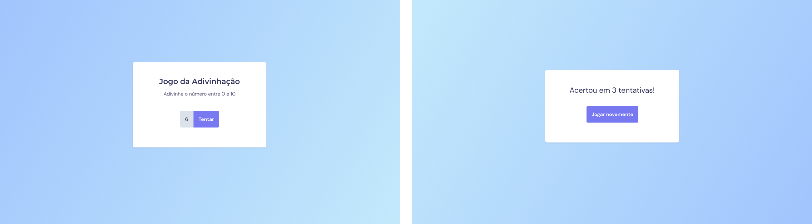

# [Guessing Game](https://igorsilvam.github.io/guessing-game)

This project aims to put into practice JavaScript, HTML and CSS, where a minigame was created to try to guess a number from 0 to 10 putting into practice manipulation of the DOM, it was elaborated in the class of Rocketseat's Explorer program.

## Tech Stack

## Usage

To use this project, go to the link:

[Link Project](https://igorsilvam.github.io/guessing-game)

## Contact

Made with ❤️ by [Igor Silva](https://github.com/igorsilvam), get in touch!

&nbsp;

